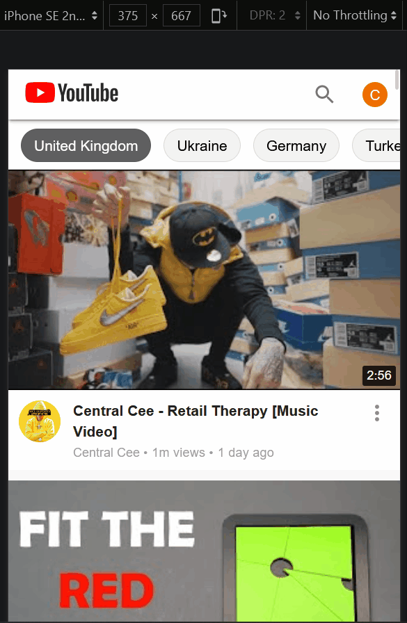
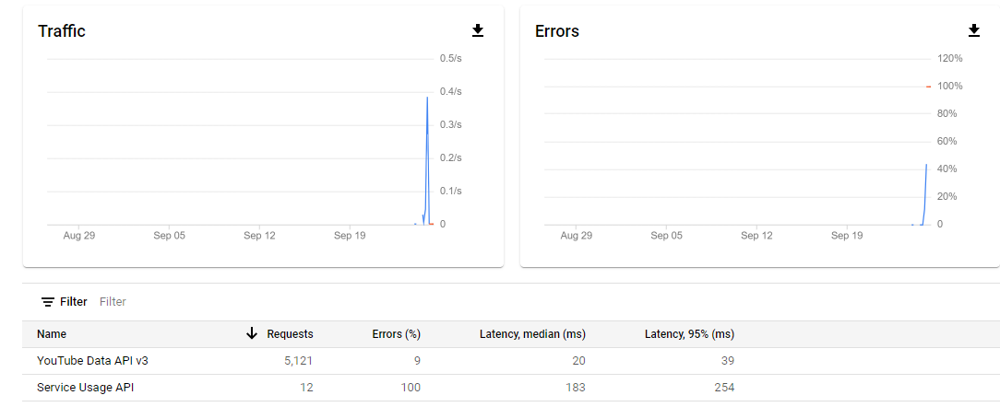

# 📺 React YouTube Clone

###  Go to the live site and try it for yourself [here](https://react-youtubeclone.netlify.app/)

## WARNING
<strong> If the app does not load anything or the search function doesn't work, it is very likely the daily YouTube API quota has exceeded. There are only 5000 daily quotas for free usage, and each search costs 100 quotas. If the app doesn't work, I hope the animated GIF here can give you an idea of how it works. </strong>

## Mobile view search function demo

## What does this app do?

- It is a clone of YouTube HomePage and SearchPage.
- HomePage displays the most popular videos of the selected country by querying data from the YouTube API.
- HomePage utilizes the infinite-scroll feature, so new video thumbnails will load when the user keeps scrolling down the page.
- Typing a word and clicking on search performs a real search on the YouTube API, displaying 25 results on the SearchPage.

## What is this project about?

- This is mainly a Material-UI and styled-components learning project. I aimed at making the website look as close to the original YouTube as possible.
- This project turned into a state and complexity management exercise as it progressed, becoming larger than initially anticipated.

## What technologies were used?

- React.js (create-react-app)
- React Router
- Axios
- Styled-components
- Material-UI v4
- Jotai

## Links to source code and live site:

- [Live site hosted on Netlify](https://react-youtubeclone.netlify.app/)
- [Source code on GitHub](https://github.com/1codingguy/react-youtube-clone)

## Detailed side-by-side comparison of the clone to the original

## Something you should expect when playing with the clone project:

- Clicking on a row in any one of the popup menus will merely close the popup menu instead of routing to another page.
- Clicking on most of the buttons won't do anything.

## Why did I build the project this way?

1. Why does the ChipsBar list different countries instead of keywords?

   - If different keywords were used, clicking on a single chip would perform a search based on that keyword.
   - A search action costs 100 quotas on the YouTube API, and the daily quota is limited to 5000 for a free account.
   - Querying popular videos from different countries only costs 1 quota.
   - So, the ChipsBar is designed this way because of the YouTube API quota.

2. Why use localStorage to save query results from YouTube?

- In the process of development, I needed to load the SearchPage repeatedly, and each search action costs 100 quotas, quickly exhausting the daily limit.
- The quota ran out once, forcing me to pause the development process. To avoid such interruptions, I opted to use localStorage.
- Below picture shows my API quota was quickly used up without using localStorage.
  

